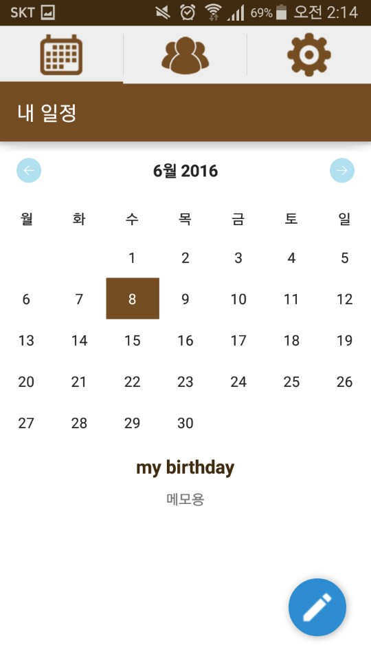
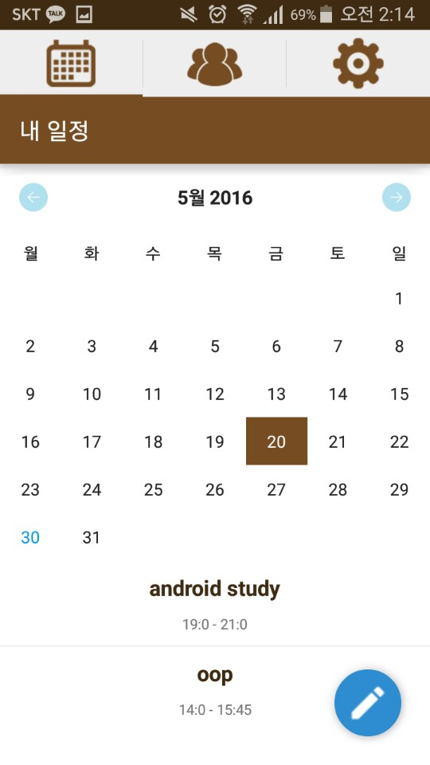
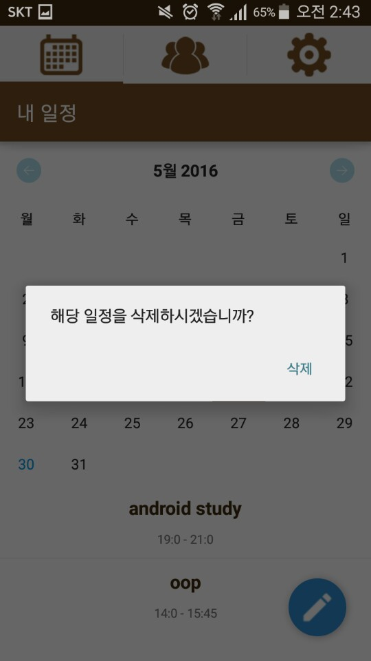
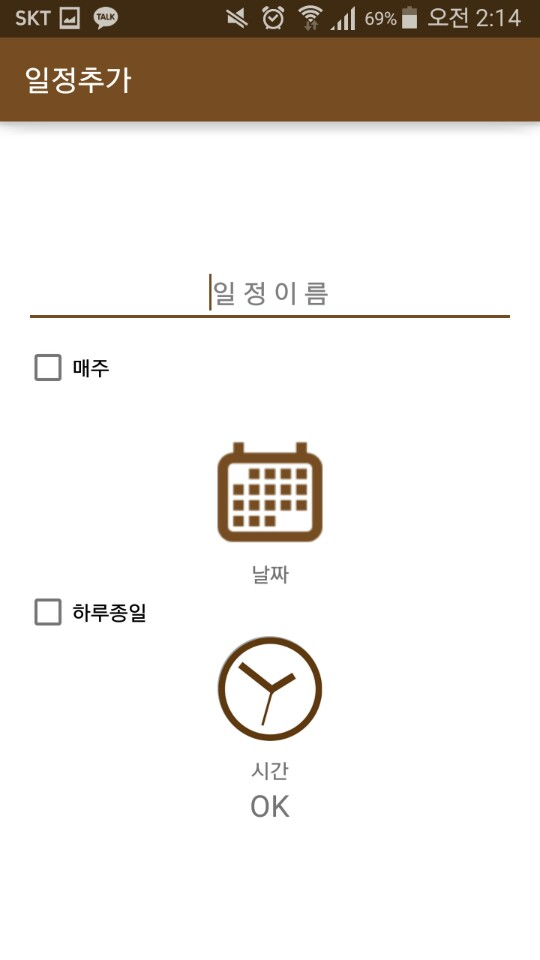
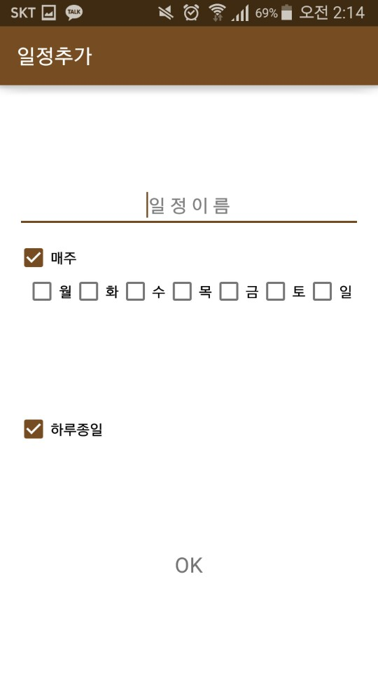
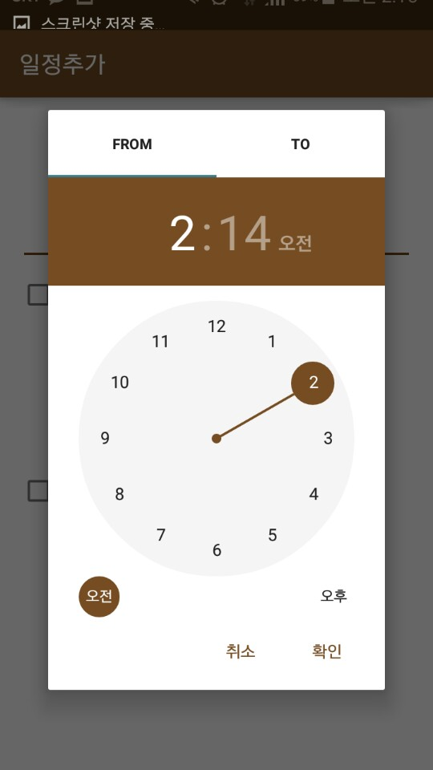
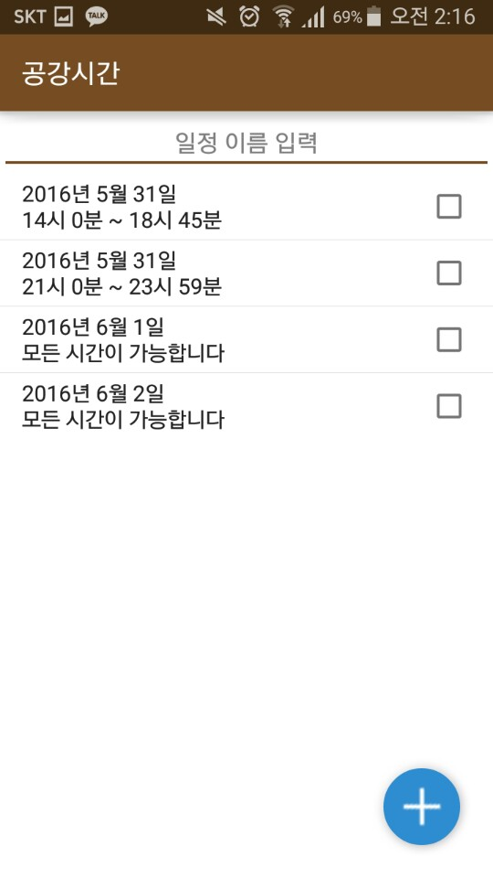

# aYa-Calendar
This application find common empty time list among many people

This is for assignment (final project : make your own program using oop concepts). I made this application using JAVA

Thanks for prof. Sungahn Ko giving great chance and teaching

### Splash

splash screen

### memo schedule

If there is no specific time of schedule, then just save it as memo schedule

### date schedule

If the schedule is regular one(ex. every Monday), you can save it not only select date but also day of week.

### delete schedule

delete schedule

### add schedule

add schedule

### add schedule date

add schedule for day of week one

### select day

select date

### select time

select time

### friend

my friend and find time data

### time slot

showing time slot

### send schedule slot

you can save friend's schedule data here and also send your data

### send schedule kakao

send data using KakaoTalk

