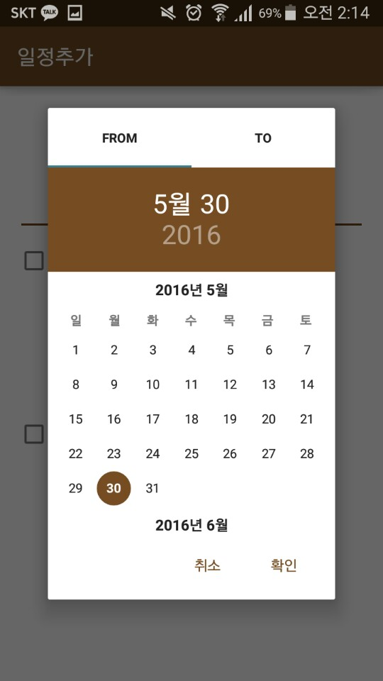

# aYa-Calendar
공강시간을 찾는 어플리케이션

splash

memo schedule

day of week or date schedule

delete schedule

add schedule

add schedule day of week

select date

select time

my friend and find time data

showing time slot

you can save friend's schedule data here and also send your data

send data using KakaoTalk
